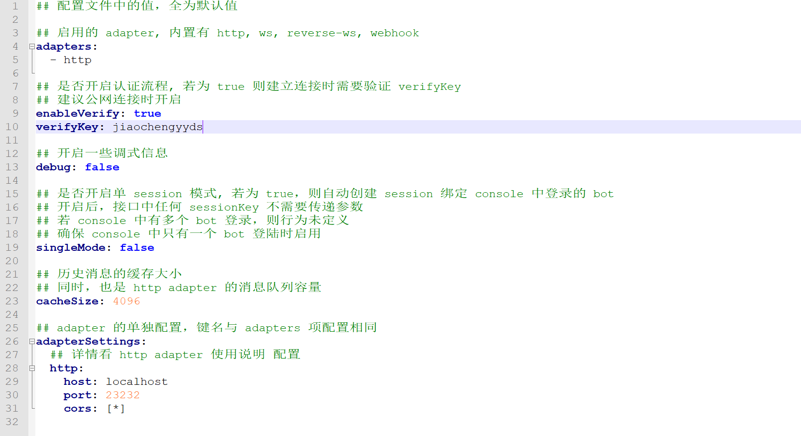

***
# 1.配置mirai-api
来到这个目录


打开这个文件


进行编辑

找到这一处
```
## 是否开启认证流程, 若为 true 则建立连接时需要验证 verifyKey
## 建议公网连接时开启
enableVerify: true
verifyKey: 注意填写啊！看github的教程！
```
将verifyKey后面填写为自己的设计的密码！不是QQ密码哦！自定义！
>这是我的样例
> 

ok!保存！

来到这个目录

双击运行**mcl.cmd**


等到出现
```
mirai-console started successfully.
```


输入指令

举例：
```
 autoLogin add 你的qq号 qq密码 
```
再输入
```
autoLogin list
```
查看是否添加成功（好像只要输入一遍才保存，一个bug）


重新启动**mcl.cmd**（就是当前窗口）

重启后：

>检查①处是否为自己设计的key
> 
>检查②处是否为自己的QQ账号，并且成功登陆


> # 一定要记得关闭此窗口，以后qq机器人启动时会自动在后台启动的
***
还没结束呢！
***
# 2.配置主配置
>
> 
> 哈哈哈~中国文化博大精深~

回到主目录


打开“config.ini”

按图填写
>这是样例：
>

保存后关闭
***
***
结束啦！
如果你在登陆地方输错了想要删除，你可以试试：
