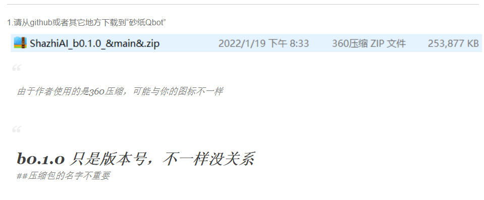
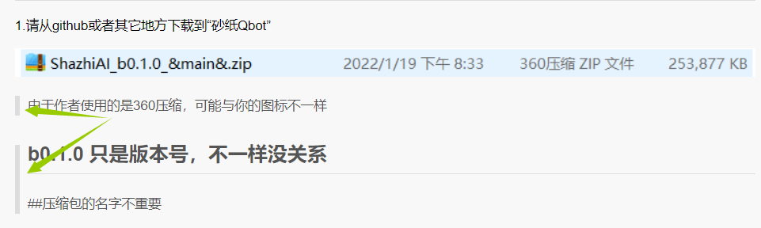

***
# 欢迎使用砂纸Qbot
***
### - 在开始前请先了解下砂纸Qbot的原理：

[<button class="btn btn-info btn-lg btn-block">介绍砂纸Qbot</button>](介绍砂纸Qbot原理/介绍砂纸Qbot原理.md)
***
### - 如果你是只想使用“砂纸Qbot”，请点击跳转：

[<button class="btn btn-info btn-lg btn-block">开始使用砂纸Qbot</button>](1.使用砂纸Qbot/介绍.md)

***
### - 如果你想为“砂纸Qbot”写插件，请点击跳转：
***

>如果您的阅览器（浏览md文件的工具）可以切换主题/风格，请使用github风格！
>> 
>> 这是错误的风格！
>
> 正确的风格
> 